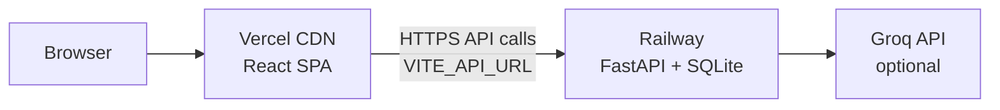

# Deployment Plan — Railway (Backend) + Vercel (Frontend)

End-to-end plan to deploy **Myntra Wishlist Decision Studio** with the FastAPI backend on [Railway](https://railway.app) and the React/Vite frontend on [Vercel](https://vercel.com).

---

## Architecture (production)



| Layer | Platform | URL example |
|-------|----------|-------------|
| Frontend | Vercel | `https://myntra-decision-studio.vercel.app` |
| Backend | Railway | `https://myntra-api-production.up.railway.app` |
| Database | SQLite on Railway | `backend/app.db` or volume `/data/app.db` |

**Important:** In production the frontend calls the Railway URL directly (`VITE_API_URL`). The Vite dev proxy is **local only**.

---

## Phase 0 — Pre-deploy (local)

Do this once before any cloud deploy.

### 0.1 Repository

- [ ] Push project to GitHub (include `data/`, `requirements.txt`, `Procfile`, `railway.toml`, `frontend/`)
- [ ] Confirm `.env` is **not** committed (only `.env.example`)

### 0.2 Backend tests & health

```powershell
cd c:\Users\AKASH\MyntraWishlist_DecisionStudio

python -m pytest backend/tests/ -q

python -c "from backend.db.init_db import init_database; init_database()"

python -m uvicorn backend.main:app --host 127.0.0.1 --port 8002
```

In a second terminal:

```powershell
.\scripts\health_check.ps1 -BaseUrl http://127.0.0.1:8002
```

**Pass criteria:** `status: ok`, `catalog_ready: true`, `product_count: 62`, categories + products endpoints OK.

### 0.3 Frontend build (local smoke)

```powershell
cd frontend
npm install
npm run build
npm run preview
```

Open preview URL and confirm the app loads (with `VITE_API_URL` pointing at local backend if testing API).

---

## Phase 1 — Deploy backend on Railway

### 1.1 Create Railway project

1. Go to [railway.app](https://railway.app) → **New Project** → **Deploy from GitHub repo**
2. Select this repository
3. **Root directory:** project root (not `frontend/`)
4. Railway reads `Procfile` and `railway.toml` automatically

### 1.2 Build & start (auto)

| Setting | Value |
|---------|--------|
| Builder | Nixpacks (from `railway.toml`) |
| Start command | `uvicorn backend.main:app --host 0.0.0.0 --port $PORT` |
| Health check | `GET /health` (120s timeout) |

On first boot, `init_database()` runs → schema + `ingest_catalog` if the DB is empty (62 products).

### 1.3 Environment variables (Railway → Variables)

| Variable | Required | Value |
|----------|----------|--------|
| `GROQ_API_KEY` | No | Your Groq key (LLM insights; fallbacks work without it) |
| `GROQ_MODEL_FAST` | No | `openai/gpt-oss-20b` |
| `GROQ_MODEL_QUALITY` | No | `openai/gpt-oss-120b` |
| `CORS_ORIGINS` | **Yes** | Set **after** Vercel deploy — see Phase 3 |
| `DATABASE_PATH` | No | `/data/app.db` if using a Railway volume |

**Do not set** `PORT` — Railway injects it.

### 1.4 Public domain

1. Railway service → **Settings** → **Networking** → **Generate domain**
2. Copy URL, e.g. `https://myntra-api-production.up.railway.app`

### 1.5 Verify backend

```powershell
curl https://YOUR-RAILWAY-URL.up.railway.app/health
```

Expected:

```json
{
  "status": "ok",
  "phase": 6,
  "catalog_ready": true,
  "product_count": 62,
  "schema_ok": true
}
```

Also check:

- `GET /api/products` → 62 products
- `GET /api/products/categories/list` → 12 categories

### 1.6 Optional — persistent SQLite

Without a volume, wishlist/bag data resets on redeploy (catalog is re-seeded).

To keep user data across deploys:

1. Railway → **Volume** → mount at `/data`
2. Set `DATABASE_PATH=/data/app.db`
3. Redeploy

---

## Phase 2 — Deploy frontend on Vercel

### 2.1 Create Vercel project

1. Go to [vercel.com](https://vercel.com) → **Add New** → **Project**
2. Import the same GitHub repo
3. Configure:

| Setting | Value |
|---------|--------|
| **Root Directory** | `frontend` |
| **Framework Preset** | Vite |
| **Build Command** | `npm run build` |
| **Output Directory** | `dist` |
| **Install Command** | `npm install` |

`frontend/vercel.json` handles SPA routing (React Router paths like `/wishlist`, `/decision-studio`).

### 2.2 Environment variables (Vercel → Settings → Environment Variables)

| Variable | Environments | Value |
|----------|--------------|--------|
| `VITE_API_URL` | Production, Preview | `https://YOUR-RAILWAY-URL.up.railway.app` |

**No trailing slash.** Example:

```
VITE_API_URL=https://myntra-api-production.up.railway.app
```

Redeploy after setting this (Vite bakes env vars at **build time**).

### 2.3 Deploy

- Click **Deploy** (or push to `main` if auto-deploy is on)
- Copy production URL, e.g. `https://myntra-decision-studio.vercel.app`

### 2.4 Verify frontend

- [ ] Home loads categories and featured products
- [ ] Wishlist heart → size → occasion flow works
- [ ] Wishlist compare / Decision Studio load
- [ ] No CORS errors in browser DevTools → Network tab

---

## Phase 3 — Wire backend ↔ frontend

Deploy order: **Railway first**, then **Vercel**, then update CORS.

### 3.1 Set CORS on Railway

In Railway variables, set `CORS_ORIGINS` to your Vercel URL(s):

```
https://myntra-decision-studio.vercel.app,https://myntra-decision-studio-*.vercel.app,http://localhost:5173,http://127.0.0.1:5173
```

Notes:

- Include **exact** production Vercel URL (no trailing slash)
- Include preview deployments if you test PR previews (`*.vercel.app` may need explicit preview URLs depending on Railway/CORS — add each preview origin or use a known preview pattern)
- Keep localhost entries for local dev against Railway if needed

Redeploy Railway after changing `CORS_ORIGINS`.

### 3.2 Rebuild Vercel (if Railway URL changed)

If you regenerated the Railway domain, update `VITE_API_URL` on Vercel and **redeploy** the frontend.

### 3.3 Connection checklist

| Check | How |
|-------|-----|
| API reachable | Browser: `https://RAILWAY-URL/health` |
| CORS | Frontend → Network → API responses have no CORS error |
| Compare works | Wishlist → select 2 items → Compare |
| Decision Studio | `/decision-studio?ids=P001,P002` loads analysis |

---

## Phase 4 — Post-deploy smoke test

Run after both services are live.

```powershell
# Backend
.\scripts\health_check.ps1 -BaseUrl https://YOUR-RAILWAY-URL.up.railway.app

# Manual frontend
# 1. Open Vercel URL
# 2. Hard refresh (Ctrl+Shift+R)
# 3. Home → products load
# 4. Add to wishlist → Wishlist page
# 5. Compare 2 items → Decision Studio
# 6. Add to bag → Place order
```

---

## Phase 5 — Optional enhancements

| Item | Action |
|------|--------|
| Custom domain (Vercel) | Vercel → Domains → add domain → update `CORS_ORIGINS` on Railway |
| Custom domain (Railway) | Railway → Custom Domain → update `VITE_API_URL` on Vercel → redeploy |
| Groq live copy | Set `GROQ_API_KEY` on Railway only (never on Vercel) |
| CI before deploy | Run `pytest backend/tests/` on GitHub Actions |
| Preview envs | Vercel preview + separate Railway staging service (optional) |

---

## Environment variable summary

### Railway (backend)

```env
GROQ_API_KEY=gsk_...
CORS_ORIGINS=https://your-app.vercel.app,http://localhost:5173,http://127.0.0.1:5173
# DATABASE_PATH=/data/app.db
```

### Vercel (frontend)

```env
VITE_API_URL=https://your-api.up.railway.app
```

### Local dev (unchanged)

| File | Content |
|------|---------|
| `frontend/.env` | `VITE_API_URL=` (empty → Vite proxy to 8002) |
| `.env` (root) | `GROQ_API_KEY`, optional `CORS_ORIGINS` |

---

## Deploy order (quick reference)

```
1. pytest + local health check
2. Railway: deploy backend → get URL → verify /health
3. Vercel: set VITE_API_URL → deploy frontend → get URL
4. Railway: set CORS_ORIGINS with Vercel URL → redeploy
5. End-to-end smoke on production URLs
```

---

## Repo files used for deploy

| File | Platform |
|------|----------|
| `Procfile` | Railway start command |
| `railway.toml` | Railway health check |
| `requirements.txt` | Railway Python deps |
| `data/products.json` | Seeded on first backend boot |
| `frontend/vercel.json` | Vercel SPA rewrites |
| `frontend/package.json` | Vercel build |
| `scripts/health_check.ps1` | Pre/post deploy smoke |

---

## Troubleshooting

| Issue | Fix |
|-------|-----|
| HTTP 500 on Home | Railway `/health` → if `catalog_ready: false`, redeploy; see [Debug.md](./Debug.md) |
| CORS error in browser | Add exact Vercel origin to Railway `CORS_ORIGINS`, redeploy backend |
| Failed to fetch | Wrong `VITE_API_URL` or backend down — rebuild Vercel after fixing URL |
| 404 on refresh (`/wishlist`) | Ensure `frontend/vercel.json` is deployed (SPA rewrite) |
| Wishlist empty after redeploy | Expected without Railway volume — catalog re-seeds, user data ephemeral |
| Health shows legacy payload | Restart Railway service to pick up latest health handler |

More detail: [Debug.md](./Debug.md) · Backend-only notes: [RailwayDeploy.md](./RailwayDeploy.md)

---

*Last updated: Railway + Vercel split deployment with health readiness and CORS wiring.*
