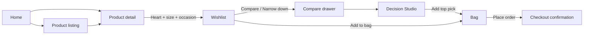

# Step-Wise Working — Frontend

How the Myntra Wishlist Decision Studio frontend is structured and how each screen works, step by step. For debugging issues, see [Debug.md](./Debug.md).

---

## 1. Overview

| Item | Detail |
|------|--------|
| Stack | React 18, Vite, React Router |
| Entry | `frontend/src/main.jsx` |
| Shell | `frontend/src/App.jsx` |
| Styles | `frontend/src/styles/app.css` |
| API | `frontend/src/api/client.js` → backend via Vite proxy (`/api` → port **8002**) |
| Demo user | `X-User-Id: U001` on every request |

### High-level user journey



---

## 2. App bootstrap (Step 0)

**File:** `frontend/src/main.jsx`

| Step | What happens |
|------|----------------|
| 1 | Vite loads `index.html` → `#root` |
| 2 | React mounts with `StrictMode` |
| 3 | `ErrorBoundary` wraps the tree — catches render crashes and shows “Something went wrong” |
| 4 | `BrowserRouter` enables client-side routing |
| 5 | `App` renders inside router |
| 6 | Global CSS (`app.css`) applied |

---

## 3. App shell (Step 1)

**File:** `frontend/src/App.jsx`

| Step | What happens |
|------|----------------|
| 1 | `ToastProvider` wraps the app — global toast messages (add/remove wishlist, bag actions) |
| 2 | **Top bar** shows brand + nav: Home, Wishlist, Bag |
| 3 | **Main area** renders the active route via `<Routes>` |

### Routes

| Path | Page | Purpose |
|------|------|---------|
| `/` | `Home.jsx` | Storefront hero, categories, featured products |
| `/products` | `ProductListing.jsx` | Full catalog; optional `?category=Dresses` |
| `/product/:productId` | `ProductDetail.jsx` | PDP — sizes, wishlist, add to bag |
| `/wishlist` | `Wishlist.jsx` | Saved items, compare, alerts, overload |
| `/bag` | `Bag.jsx` | Cart + mock checkout |
| `/decision-studio` | `DecisionStudio.jsx` | Full analysis; query `?ids=P001,P002,P003&from=6` |

---

## 4. API layer (Step 2)

**File:** `frontend/src/api/client.js`

| Step | What happens |
|------|----------------|
| 1 | `VITE_API_URL` empty in dev → requests go to same origin (`/api/...`) |
| 2 | Vite proxy forwards `/api` and `/health` to `http://127.0.0.1:8002` |
| 3 | Every `fetch` adds `Content-Type: application/json` and `X-User-Id: U001` |
| 4 | Non-OK responses throw with `detail` or `HTTP {status}` |
| 5 | Network failure shows message to start backend on port 8002 |

### Main API methods used by UI

| Method | Used on |
|--------|---------|
| `getCategories`, `getProducts` | Home, Product listing |
| `getProduct` | Product detail, wishlist add fallback |
| `getWishlist`, `addToWishlist`, `removeFromWishlist` | Wishlist flow |
| `compareWishlist`, `shortlistWishlist` | Wishlist compare, overload narrow-down, Decision Studio |
| `getPriceInsight`, `getReviewInsight` | Wishlist card actions |
| `listQuestions`, `answerQuestion` | Wishlist + Decision Studio |
| `getBag`, `addToBag`, `removeFromBag`, `checkout` | Bag |

---

## 5. Shared state & hooks (Step 3)

### Toast — `state/ToastContext.jsx`

- `showToast(message)` — auto-dismisses after ~2.8s
- Used after wishlist/bag actions

### Wishlist add — `hooks/useWishlistAdd.js`

Central hook for **heart button** on Home, listing, and PDP.

| Step | State / action |
|------|----------------|
| 1 | On mount → `GET /api/wishlist` → builds `ids` Set |
| 2 | Tap heart on **saved** item → `DELETE /api/wishlist/{id}` → toast “Removed” |
| 3 | Tap heart on **new** item → `startAddFlow(product)` |
| 4 | If product has sizes → `addStep = "size"` → `WishlistSizeModal` |
| 5 | User picks size → `confirmSize` → `addStep = "occasion"` → `WishlistOccasionModal` |
| 6 | User picks occasion → `POST /api/wishlist` with `{ product_id, occasion, size }` |
| 7 | Cancel at any step → `resetPending()` |

**Modals:** `WishlistAddModals.jsx` → `WishlistSizeModal.jsx` + `WishlistOccasionModal.jsx`

### Bag IDs — `hooks/useBagIds.js`

- Tracks which product IDs are in bag (`GET /api/bag`)
- `add(productId)` / `has(productId)` for buttons on Wishlist, PDP, Decision Studio

### Decision context — `lib/decisionContext.js` + `hooks/useDecisionContext.js`

- Persists in **localStorage** (`decisionStudioContext`)
- Fields: `need`, `tradeoff`, `confidence` (0–4)
- `compareOptionsFromContext()` → sent with every compare/shortlist call
- Changing need/trade-off/confidence on Decision Studio **re-fetches** compare

---

## 6. Page flows (step by step)

### 6.1 Home (`/`)

**File:** `pages/Home.jsx`

| Step | User sees | Frontend does |
|------|-----------|---------------|
| 1 | “Loading storefront…” | `Promise.all([getCategories(), getProducts()])` |
| 2 | Error banner + Retry | Shows `ErrorBanner` if API fails |
| 3 | Category chips | Links to `/products?category={name}` |
| 4 | Featured grid (6 items) | `ProductCard` per product |
| 5 | Heart on card | `useWishlistAdd.handleToggle` → modals if adding |
| 6 | Click card body/image | Navigates to `/product/{id}` |

---

### 6.2 Product listing (`/products`)

**File:** `pages/ProductListing.jsx`

| Step | User sees | Frontend does |
|------|-----------|---------------|
| 1 | Title = category name or “All products” | Reads `?category=` from URL |
| 2 | Filter chips | All + each category; active chip highlighted |
| 3 | Product grid | Same `ProductCard` + wishlist flow as Home |
| 4 | Empty state | If category has no products |

---

### 6.3 Product detail (`/product/:productId`)

**File:** `pages/ProductDetail.jsx`

| Step | User sees | Frontend does |
|------|-----------|---------------|
| 1 | Loading | `GET /api/products/{productId}` |
| 2 | Image + heart overlay | `WishlistHeart` + wishlist add flow |
| 3 | Price, rating, brand | From product payload |
| 4 | Size chips | Clickable; `selectedSize` state; `sizeGuide.js` shows measurements |
| 5 | “Add to Wishlist” | Same as heart — opens size → occasion if needed |
| 6 | “Add to Bag” | Requires size if sizes exist → `POST /api/bag` |
| 7 | Button shows “Added to Bag” | When `useBagIds.has(productId)` |

---

### 6.4 Wishlist (`/wishlist`)

**File:** `pages/Wishlist.jsx` — core Decision Studio entry point

#### Load

| Step | Frontend does |
|------|---------------|
| 1 | `GET /api/wishlist` → items, alerts, overload groups |
| 2 | `refreshBag()` for bag button states |
| 3 | Groups items by **occasion** (`groupByOccasion`) |
| 4 | Renders `WishlistAlerts` (price drop, similar product, etc.) |

#### Toolbar

| Action | Requirement | API |
|--------|-------------|-----|
| **Compare my options** | 2–3 items selected | `POST /api/wishlist/compare` |
| **Ask questions** | ≥1 selected | Opens `QuestionSheet` |
| **Clear** | Clears selection | Local state only |

#### Per card (`WishlistCard.jsx`)

| Action | API |
|--------|-----|
| Checkbox | Toggle compare selection (max 3) |
| Remove | `DELETE /api/wishlist/{id}` |
| Add to Bag | `POST /api/bag` |
| Price insight | `GET /api/products/{id}/price-insight` |
| Review insight | `GET /api/products/{id}/review-insight` |

#### Compare drawer (`CompareDrawer.jsx`)

| Step | What happens |
|------|--------------|
| 1 | User selects 2–3 items → **Compare my options** |
| 2 | Drawer opens; loading “Building comparison…” |
| 3 | `compareWishlist(ids, compareOptionsFromContext())` |
| 4 | Shows top pick + compact `ComparisonTable` |
| 5 | **View full analysis** → `/decision-studio?ids=P001,P002,P003` |

#### Overload modal (`DecisionOverloadModal.jsx`)

| Step | What happens |
|------|--------------|
| 1 | Shown when similar group has **>5 items** (6+) |
| 2 | **Narrow them down** → `narrowDown()` |
| 3 | If >3 IDs → `POST /api/wishlist/shortlist` (need + trade-off from localStorage) |
| 4 | Top 3 auto-selected; compare drawer opens with results |
| 5 | Alert dismissed; toast “Narrowed N items to 3” |

#### Question sheet (`QuestionSheet.jsx`)

| Step | What happens |
|------|--------------|
| 1 | `GET /api/questions?product_count=N&offset=0` |
| 2 | User picks question → **Submit** |
| 3 | `POST /api/questions/answer` with `question_id` + product id(s) |
| 4 | Shows answer; optional “Ask another” (offset++) |

---

### 6.5 Decision Studio (`/decision-studio`)

**File:** `pages/DecisionStudio.jsx`  
**Query:** `?ids=P001,P002,P003` optional `&from=6` (after narrow-down)

#### Setup panel — `DecisionStudioSetup.jsx`

| Step | Label | Saves to localStorage |
|------|-------|------------------------|
| 01 | Define the need (Workwear, Casual, Party, Sports, Vacation) | `need` |
| 02 | Trade-off priority (Fit, Value, Quality, Versatility) | `tradeoff` |
| 03 | Confidence slider (0–4) | `confidence` |

Any change → `loadCompare()` runs again with new options.

#### Analysis panel

| Step | UI block | Data source |
|------|----------|-------------|
| 1 | Top pick + Add to Bag | `result.labels.best_balance` |
| 2 | Need-fit warning (if partial/poor) | `result.top_pick_need_fit` |
| 3 | Need fit by item | `result.need_assessment` |
| 4 | **Decision insight** — summary + best value/reviewed/balance chips | `result.summary`, `result.labels` |
| 5 | Comparison table | `result.rows`, `result.products` |
| 6 | Ask a question | Same `QuestionSheet` as Wishlist |

Compare API body includes:

```json
{
  "product_ids": ["P001", "P002"],
  "need": "Party",
  "tradeoff_priority": "FIT",
  "user_confidence": 2
}
```

---

### 6.6 Bag (`/bag`)

**File:** `pages/Bag.jsx`

| Step | User sees | Frontend does |
|------|-----------|---------------|
| 1 | Loading | `GET /api/bag` |
| 2 | Line items + total | Renders product thumb, name, price |
| 3 | Remove | `DELETE /api/bag/{id}` → reload |
| 4 | Place order | `POST /api/checkout` |
| 5 | Confirmation sheet | `CheckoutConfirmation.jsx` with order id + total |
| 6 | Bag cleared | After successful checkout |

---

## 7. Key components map

```
App
├── ToastProvider
├── Topbar (nav)
└── Routes
    ├── Home / ProductListing
    │   ├── ProductCard
    │   │   ├── ProductImage
    │   │   └── WishlistHeart
    │   └── WishlistAddModals
    │       ├── WishlistSizeModal
    │       └── WishlistOccasionModal
    ├── ProductDetail (same wishlist modals + sizeGuide)
    ├── Wishlist
    │   ├── WishlistAlerts / PriceAlert / SimilarProductAlert
    │   ├── WishlistCard
    │   ├── DecisionOverloadModal
    │   ├── CompareDrawer → ComparisonTable
    │   ├── QuestionSheet
    │   ├── PriceInsight
    │   └── ReviewInsight
    ├── DecisionStudio
    │   ├── DecisionStudioSetup
    │   ├── ComparisonTable
    │   └── QuestionSheet
    └── Bag → CheckoutConfirmation
```

### Shared UI primitives

| Component | Role |
|-----------|------|
| `LoadingState` | Spinner + message while fetching |
| `ErrorBanner` | Error text + optional Retry |
| `EmptyState` | No data + CTA button |
| `ProductImage` | Image with fallback on error |
| `ComparisonTable` | Metric rows × product columns; highlights labels |

---

## 8. End-to-end flows (quick reference)

### A. Save to Wishlist (from grid)

1. User taps ♡ on `ProductCard`
2. `useWishlistAdd` → size modal (if sizes exist)
3. Occasion modal
4. `POST /api/wishlist`
5. Heart fills; toast confirms
6. Item appears on `/wishlist` under chosen occasion group

### B. Compare from Wishlist

1. Check 2–3 items
2. **Compare my options**
3. Compare drawer shows top pick + table
4. **View full analysis** → Decision Studio with same IDs

### C. Overload → narrow → decide

1. Save 6+ similar items (e.g. sneakers)
2. Overload modal appears
3. **Narrow them down** → shortlist API → top 3
4. Compare drawer opens
5. Open full Decision Studio
6. Set need + trade-off → top pick updates
7. **Add top pick to Bag**

### D. Checkout

1. Add items from Wishlist or Decision Studio
2. Go to **Bag**
3. **Place order** → mock confirmation (no payment)

---

## 9. Local persistence

| Key | Location | Contents |
|-----|----------|----------|
| `decisionStudioContext` | `localStorage` | `{ need, tradeoff, confidence }` |

Wishlist, bag, and catalog live on the **backend** (SQLite), not in browser storage.

---

## 10. Running the frontend

```powershell
cd frontend
npm run dev
```

Open **http://127.0.0.1:5173** (see `vite.config.js` — `host: 127.0.0.1`, proxy to 8002).

Full stack: `.\scripts\start_dev.ps1` from project root.

---

## 11. File index

| Path | Role |
|------|------|
| `src/main.jsx` | Bootstrap |
| `src/App.jsx` | Layout + routes |
| `src/api/client.js` | HTTP client |
| `src/pages/*.jsx` | Route pages |
| `src/components/*.jsx` | UI building blocks |
| `src/hooks/*.js` | Reusable state logic |
| `src/lib/decisionContext.js` | Decision Studio prefs |
| `src/lib/sizeGuide.js` | PDP size copy |
| `src/state/ToastContext.jsx` | Toasts |
| `src/styles/app.css` | All styles |
| `vite.config.js` | Dev server + API proxy |
| `.env` | `VITE_API_URL=` (empty = proxy) |

---

*Aligned with current frontend as of Decision Studio BUILD (need/trade-off/confidence, size→occasion wishlist flow, overload narrow-down, compare drawer → full analysis).*
